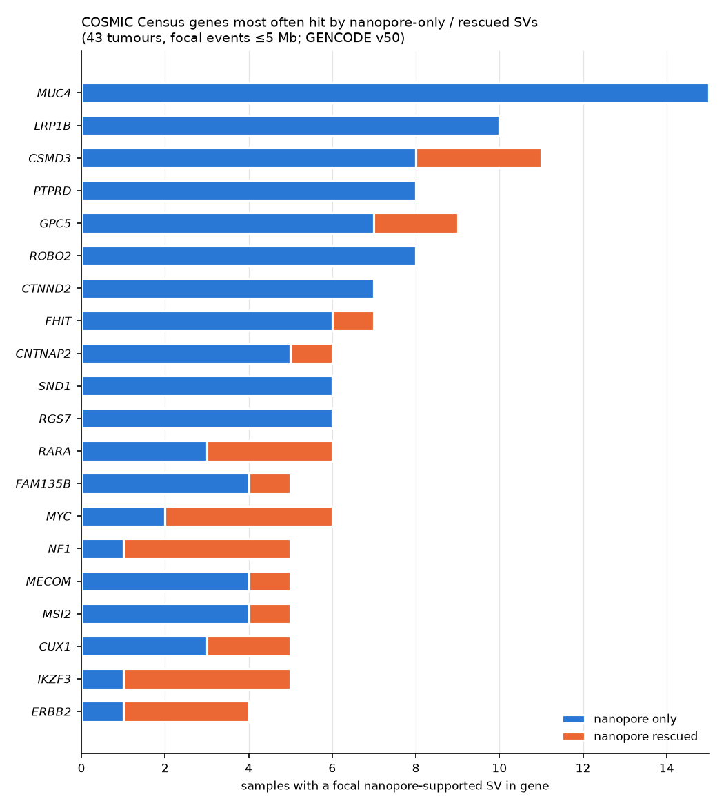

# Nanopore-only and nanopore-rescued SVs in COSMIC Cancer Gene Census genes

Date: 2026-09-30. Code: `src/pogcohort/sv_annotation.py`, `genes.py`, `cosmic.py`;
driver `src/run_cancer_gene_annotation.py`; tests in `tests/` (33 pass).
Full per-hit tables: `results/cancer_gene_sv/all/` (not committed).
Small tables here: `cancer_gene_sv_per_sample.tsv`, `cancer_gene_sv_recurrent_genes.tsv`,
chart `cancer_gene_sv_top_genes.png`.

Built and checked on 3 samples (POG044, POG049, POG068) before the 43.

## 1. Inputs and definitions

- **SVs:** the MAVIS combined table after the paper's filters, categories
  `nanopore_only` (no Illumina support at all) and `nanopore_rescued`
  (nanopore support plus an Illumina call the authors' quality flag discards).
  12,449 SVs across 43 tumours.
- **Genes:** GENCODE **v50** (GRCh38, Ensembl 116; file dated 2026-04-08),
  78,733 genes; exons merged per gene across transcripts (459,010 intervals).
  *GTF* = Gene Transfer Format, one line per gene/transcript/exon with 1-based
  coordinates.
- **Cancer genes:** the COSMIC Cancer Gene Census copy in
  `data/pog/phasing/cosmic-gene-census.csv` (732 genes), joined on Ensembl
  gene ID. The Census is COSMIC's curated list of genes with causal evidence
  in cancer; Tier 1 = strong, Tier 2 = emerging.
- **Effect** per (SV, gene): `whole_gene` (gene entirely inside a deletion/
  duplication/inversion span), `breakpoint_exon` or `breakpoint_intron` (a
  breakpoint falls inside the gene). For a deletion `whole_gene` means loss;
  for a duplication, gain; for an **inversion it means the gene is moved
  intact**, not disrupted — read the SV type with the effect.
- **Focal vs large:** events spanning > 5 Mb are set aside as `large_event`.
  They produce 7,865 of the 8,769 Census hits but each is a chromosome-arm-
  scale copy-number change that says nothing about an individual gene.
  All counts below are **focal** unless stated.
- **Driver in tumour type:** keyword match between the Census "Tumour
  Types(Somatic)" text and the sample's `tumour_type_cohort` code (e.g. BRCA
  → "breast"). `yes` = a keyword matched; `no` = the Census lists other
  tumour types; `unknown` = no keywords for that code or empty Census text.
  This is a crude lookup, not a clinical assertion (e.g. NF1 in a sarcoma
  reads "no" because the Census text says "neurofibroma; glioma").

## 2. Cohort totals (focal)

- 904 (SV, Census gene) hits: 533 nanopore-only, 371 nanopore-rescued.
- 355 distinct Census genes; every one of the 43 tumours has ≥ 1 hit.
- Effect: 437 breakpoint-in-intron, 409 whole-gene, 58 breakpoint-in-exon.
- Tier 1 genes: 631 hits in 279 genes.
- Driver-in-tumour-type keyword match: 130 yes / 680 no / 94 unknown.

## 3. Per sample

`cancer_gene_sv_per_sample.tsv` — distinct Census genes with a focal hit,
split by category, plus the count with a tumour-type keyword match, and the
`low_agreement` flag. Range: 1 gene (POG044) to 46 (POG320). The five
low-agreement samples are flagged in that table; the two MSI tumours
(POG884, POG986) have the most nanopore-only hits (25 and 29 genes) because
their nanopore-only calls are mostly small insertions in repeats.

## 4. Recurrent genes

Top 20 by number of samples with a focal hit (`cancer_gene_sv_recurrent_genes.tsv`
has 50). Gene length added because **recurrence here tracks gene length**:
the median protein-coding gene is 29 kb; eight of the top ten are > 900 kb.

| Gene | Tier | Samples | SVs | Length (kb) | SVs / Mb | Type-match | Reading |
|---|---|---|---|---|---|---|---|
| MUC4 | 2 | 15 | 16 | 65 | 246 | 0 | 11 of 16 are insertions in exon — MUC4 has a long tandem-repeat exon; almost certainly repeat-length polymorphism, not cancer |
| LRP1B | 1 | 10 | 22 | 1,900 | 12 | 5 | very long gene, common fragile site; intronic insertions/deletions |
| CSMD3 | 2 | 8 | 32 | 1,214 | 26 | 2 | long gene; POG068 alone has 9 SVs (clustered rearrangement, §5) |
| PTPRD | 2 | 8 | 13 | 2,299 | 6 | 1 | long, fragile-site gene; all intronic |
| GPC5 | 2 | 8 | 12 | 1,475 | 8 | 2 | long; all intronic |
| ROBO2 | 2 | 8 | 12 | 1,743 | 7 | 1 | long; all intronic |
| CTNND2 | 2 | 7 | 9 | 933 | 10 | 0 | long; all intronic |
| FHIT | 1 | 6 | 11 | 1,504 | 7 | 0 | FRA3B fragile site — intronic deletions here are a known artefact/passenger class |
| CNTNAP2 | 2 | 6 | 9 | 2,305 | 4 | 0 | longest gene in the table; all intronic |
| SND1 | 1 | 6 | 9 | 440 | 20 | 2 | mixed translocation/duplication; worth a look |
| RGS7 | 2 | 6 | 6 | 590 | 10 | 0 | all intronic |
| RARA | 1 | 5 | 8 | 48 | 167 | 0 | 17q12-21 amplicon neighbour of ERBB2 (see below) |
| FAM135B | 2 | 5 | 8 | 367 | 22 | 2 | |
| MYC | 1 | 5 | 7 | 8 | 875 | 0 | 7 whole-gene hits, mostly duplications/inversions: MYC-region amplification structure resolved by nanopore |
| NF1 | 1 | 5 | 6 | 287 | 21 | 0 | 4 translocation + 2 deletion breakpoints inside NF1, 2 in exons; 4 of 5 samples rescued |
| MECOM | 1 | 5 | 5 | 580 | 9 | 0 | |
| MSI2 | 1 | 5 | 5 | 429 | 12 | 0 | |
| CUX1 | 1 | 5 | 5 | 468 | 11 | 1 | |
| IKZF3 | 1 | 4 | 9 | 107 | 84 | 8 | all four samples are breast/ovarian: 17q12 ERBB2 amplicon |
| ERBB2 | 1 | 4 | 8 | 43 | 186 | 8 | POG137 (breast): 5 nanopore-only breakpoints inside ERBB2 on top of 2 concordant short-read ones (§5b); POG303, POG320 (breast), POG777 (ovarian): whole-gene within 2–5 Mb rescued events |

Take-away: by sample count the list is dominated by long genes (length
bias); by SV density the interesting entries are **ERBB2/IKZF3/RARA** (the
17q12 amplicon in breast cancers, where nanopore resolves rearrangement
structure short reads miss), **MYC**, **NF1**, and **SND1**. A length-normalised
or background-corrected recurrence test is the obvious next step.

## 5. Five raw hits, read one by one

From the 3-sample subset (`results/cancer_gene_sv/subset_POG044_POG049_POG068/cosmic_hits.tsv`).

| # | Sample (type) | SV | Position (GRCh38) | Gene | Effect | Category |
|---|---|---|---|---|---|---|
| 1 | POG044 (oligodendroglioma) | deletion, 1.56 Mb, SAVANA only | chr16:2,916,666–4,481,157 | CREBBP (T1, oncogene/TSG/fusion) | whole_gene | nanopore_only |
| 2 | POG068 (pleomorphic sarcoma) | deletion, 2.59 Mb, delly + nanomonsv | chr2:44,810,836–47,403,146 | MSH2 (T1, TSG) | breakpoint_exon | nanopore_rescued |
| 3 | POG049 (adrenocortical) | insertion, nanomonsv only | chr7:55,167,011 | EGFR (T1, oncogene) | breakpoint_intron | nanopore_only |
| 4 | POG049 (adrenocortical) | inversion, 538 kb, SAVANA only | chr19:50,074,455–50,612,158 | POLD1 (T1, TSG) | whole_gene | nanopore_only |
| 5 | POG068 (pleomorphic sarcoma) | translocation, delly + nanomonsv | chr17:31,227,572 ↔ chr4:158,059,076 | NF1 (T1, TSG/fusion) | breakpoint_exon | nanopore_rescued |

1. **CREBBP, POG044.** A 1.56 Mb somatic deletion on 16p13.3 that removes
   CREBBP and its neighbours, called by SAVANA alone — no nanomonsv, no
   Illumina SV call. POG044 is a low-agreement sample with 75× nanopore depth.
   A deletion this size should show as a copy-number drop in the Illumina
   data; the Ploidetect copy-number archive (not downloaded) would settle
   whether it is real. Census tumour types for CREBBP are leukaemia/lymphoma,
   so keyword match is "no", though CREBBP loss is also reported in gliomas.
2. **MSH2, POG068.** A 2.59 Mb deletion whose left breakpoint falls in an
   MSH2 exon (and which removes SIX2 and EPAS1 entirely). delly, nanomonsv
   and the RNA assembler agree; only MAVIS's Illumina quality flag was low,
   which is why the authors' filter would have dropped it. One MSH2 allele is
   truncated; the sample is MSS with TMB 4.9, so the other allele is
   presumably intact. Credible event, correctly rescued.
3. **EGFR, POG049.** A nanomonsv insertion in an EGFR intron (size not in the
   main table; the `_ins` table has it). Intronic insertions called only by
   nanopore are overwhelmingly mobile-element or repeat insertions; no
   functional claim. This is the typical nanopore-only hit and the reason
   intronic insertions need to be down-weighted.
4. **POLD1, POG049.** A 538 kb inversion that contains POLD1 whole. Both
   breakpoints are outside the gene, so POLD1 is relocated intact — the
   `whole_gene` label on an inversion is *not* a loss. Flagged here as a
   reminder that effect must be read with SV type; a follow-up should
   subdivide `whole_gene` by type.
5. **NF1, POG068.** A translocation between chr17 and chr4 with its chr17
   breakpoint inside an NF1 exon; delly and nanomonsv agree, Illumina flag
   low. In a high-grade sarcoma NF1 inactivation is biologically plausible
   (MPNST-type biology) even though the Census text lists only neurofibroma
   and glioma, so the keyword match reads "no" — an example of the keyword
   method under-calling.

## 5b. ERBB2 in POG137 — what short reads saw and what nanopore added

POG137 is a breast invasive ductal carcinoma (tumour content 41%). ERBB2 is
chr17:39,687,914–39,730,426 (GENCODE v50).

**Short-read calls (MAVIS table `mavis_summary_somatic_gd-P00303.tab`,
chr17:39.3–39.9 Mb):** 9 somatic calls, 7 flagged high quality. Two have a
breakpoint *inside* ERBB2 — an inversion 17:39,380,248–39,712,409 (delly +
manta + transabyss) and an inversion 17:39,687,978–39,689,411 (delly +
transabyss). The rest are inversions and chr5 translocations with
breakpoints 0.1–0.5 Mb away (17:39,357,367; 39,819,611; 39,828,3xx) and one
17:30.7–39.4 Mb inversion. Both ERBB2-internal short-read calls are also
present in nanopore, i.e. they are `both` in the combined table.

**Nanopore-only calls inside ERBB2 (all SAVANA):**

| ID | type | break1 | break2 | size |
|---|---|---|---|---|
| savana_ID_37048_1 | inversion | chr17:39,695,299 | chr17:39,819,826 | 125 kb |
| savana_ID_37049_1 | inversion | chr17:39,698,671 | chr17:39,750,935 | 52 kb |
| savana_ID_37050_1 | inversion | chr17:39,712,980 | chr17:39,733,840 | 21 kb |
| savana_ID_16840_1 | translocation | chr17:39,689,443 | chr5:105,601,603 | — |
| savana_ID_37140_1 | inversion | chr17:30,372,205 | chr17:39,715,006 | 9.3 Mb |

plus three nanopore-only calls within 0.1 Mb (a 33 kb deletion at
39.76–39.80 Mb and translocations to chr5 and chr15).

**Amplification (short-read Ploidetect, `Ploidetect/POG137/P00303_P00296/cna_condensed.txt`):**
ERBB2 sits in a high-level amplicon. Segments across chr17:39.60–39.83 Mb
have total copy number 50–57 (39.60–39.69 Mb) stepping up to **187–217
copies across the gene body (39.69–39.74 Mb)** and 157–178 copies out to
39.83 Mb, against CN 1.75 on either flank. ERBB2 expression is 2,508 TPM,
the highest of 187 tumours (cohort median 46). AmpliconArchitect ecDNA
count is 0; the paper does not mention ERBB2 or POG137.

The copy-number segment boundaries, which come only from short-read depth,
line up with the nanopore-only breakpoints:

| Ploidetect segment boundary | CN change | nearest nanopore-only breakpoint |
|---|---|---|
| 39,692,214 | 57 → 217 | 39,689,443 (chr5 translocation), 39,695,299 (125 kb inv) |
| 39,709,626 | 194 → 191 | 39,712,980 (21 kb inv) |
| 39,729,603 / 39,736,251 | 187 → 206 → 191 | 39,733,840 (21 kb inv end) |
| 39,755,099 | 191 → 174 | 39,750,935 (52 kb inv end) |
| 39,760,905 | 174 → 178 (A/B 150/28) | 39,761,616 (33 kb deletion start) |
| 39,816,225 / 39,820,670 | 174 → 170 → 157 | 39,819,826 (125 kb inv end) |

**Precise claim:** short reads did *not* miss this event — they called the
amplification (≈200 copies) and two high-quality rearrangement breakpoints
inside ERBB2, plus seven more within 0.5 Mb, all concordant with nanopore.
What nanopore added is **five further breakpoints inside the gene** (three
nested inversions of 21–125 kb, a chr5 translocation, a 9.3 Mb inversion),
and these coincide with copy-number steps in the independent short-read
depth signal. That argues they are real sub-structure of the amplicon rather
than SAVANA over-segmenting a high-copy region, though read-level review is
still the proper confirmation.

## 6. Caveats

- Recurrence is length-biased (section 4); MUC4 and FHIT-type hits are
  expected artefact/passenger classes.
- `whole_gene` conflates loss (deletion), gain (duplication) and relocation
  (inversion).
- Insertion sizes are not in the main table (see the reconciliation summary).
- Tumour-type matching is keyword-based on free text; treat "no" as "not
  checked", not "not a driver".
- Hits inside > 5 Mb events (7,865) are excluded from all counts; they
  belong in a copy-number analysis.
- The five low-agreement samples are included and flagged, not removed.
